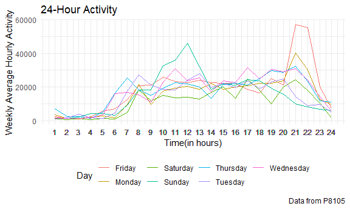
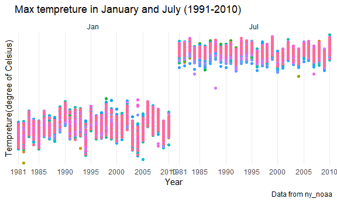
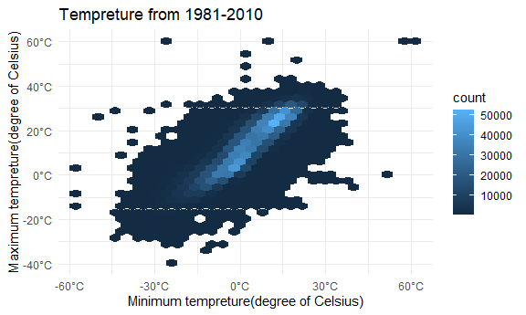
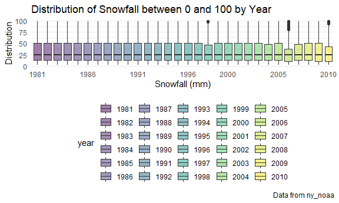

P8105-HW3-zc2556
================
Zhe Chen
2020/10/10

## Problem 1

### Include Relevent Libraries

``` r
library(tidyverse)
```

    ## -- Attaching packages ------------------------------------------------------ tidyverse 1.3.0 --

    ## √ ggplot2 3.3.2     √ purrr   0.3.4
    ## √ tibble  3.0.3     √ dplyr   1.0.2
    ## √ tidyr   1.1.2     √ stringr 1.4.0
    ## √ readr   1.3.1     √ forcats 0.5.0

    ## -- Conflicts --------------------------------------------------------- tidyverse_conflicts() --
    ## x dplyr::filter() masks stats::filter()
    ## x dplyr::lag()    masks stats::lag()

``` r
library(p8105.datasets)
```

### Implement Some Default Settings

### Basic Description of the Data Set

``` r
data("instacart")
```

The data contains 1384617 rows and 15 columns. Each observations are
assigned with the number of items and user ID. We have information about
order/order ID, days and hours. Also, we have item information, like
name, aisle, department and codes.

### Answering Questions

#### Aisles

``` r
#count for the number of aisles and find the most popular aisle
instacart %>%
  count(aisle) %>%
  arrange(desc(n))
```

    ## # A tibble: 134 x 2
    ##    aisle                              n
    ##    <chr>                          <int>
    ##  1 fresh vegetables              150609
    ##  2 fresh fruits                  150473
    ##  3 packaged vegetables fruits     78493
    ##  4 yogurt                         55240
    ##  5 packaged cheese                41699
    ##  6 water seltzer sparkling water  36617
    ##  7 milk                           32644
    ##  8 chips pretzels                 31269
    ##  9 soy lactosefree                26240
    ## 10 bread                          23635
    ## # ... with 124 more rows

We can see there are 134 different aisles and “fresh vegetables” has the
most items.

#### Plot

``` r
instacart %>%
  count(aisle) %>%
  filter(n > 10000) %>%
  mutate(
    aisle = factor(aisle),
    aisle = fct_reorder(aisle, n) #rearrange the frame
  ) %>%
  ggplot(aes(x = aisle, y = n))+
  geom_point()+
  theme(axis.text.x = element_text(angle = 90, vjust = 0.5, hjust = 1))
```


#### Make a Table of Targeted Aisles

``` r
instacart %>%
  filter( aisle %in% c("baking ingredients", "dog food care","packaged vegetables fruits"))%>%
  group_by(aisle)%>%
  count(product_name)%>%
  mutate(
    rank = min_rank(desc(n))
  )%>%
  filter(rank < 4) %>%
  arrange(aisle, rank)%>%
  knitr::kable()
```

| aisle                      | product\_name                                 |    n | rank |
| :------------------------- | :-------------------------------------------- | ---: | ---: |
| baking ingredients         | Light Brown Sugar                             |  499 |    1 |
| baking ingredients         | Pure Baking Soda                              |  387 |    2 |
| baking ingredients         | Cane Sugar                                    |  336 |    3 |
| dog food care              | Snack Sticks Chicken & Rice Recipe Dog Treats |   30 |    1 |
| dog food care              | Organix Chicken & Brown Rice Recipe           |   28 |    2 |
| dog food care              | Small Dog Biscuits                            |   26 |    3 |
| packaged vegetables fruits | Organic Baby Spinach                          | 9784 |    1 |
| packaged vegetables fruits | Organic Raspberries                           | 5546 |    2 |
| packaged vegetables fruits | Organic Blueberries                           | 4966 |    3 |

#### Make a Table Showing the Mean Hour of the Day between “Apples” and “Ice Cream”

``` r
instacart %>%
  filter(product_name %in% c("Pink Lady Apples", "Coffee Ice Cream")) %>%
  group_by(product_name, order_dow)%>%
  summarise(mean_hour = mean(order_hour_of_day))%>%
  pivot_wider(
    names_from = order_dow,
    values_from = mean_hour
  )
```

    ## `summarise()` regrouping output by 'product_name' (override with `.groups` argument)

    ## # A tibble: 2 x 8
    ## # Groups:   product_name [2]
    ##   product_name       `0`   `1`   `2`   `3`   `4`   `5`   `6`
    ##   <chr>            <dbl> <dbl> <dbl> <dbl> <dbl> <dbl> <dbl>
    ## 1 Coffee Ice Cream  13.8  14.3  15.4  15.3  15.2  12.3  13.8
    ## 2 Pink Lady Apples  13.4  11.4  11.7  14.2  11.6  12.8  11.9

## Problem 2

### Import and Clean the Data

``` r
accel =
  read.csv("./accel_data.csv")%>% #import data 
  pivot_longer(
    activity.1:activity.1440,
    values_to = "Measures",
    names_to = "Activity_Minute",
    names_prefix = "activity."
  )%>% # merging vairables
  rename(
    Day = day,
    Week = week,
    Day_Number = day_id
  )%>% # change to more reasonable vairable names.
  mutate(
    Weekday_or_Weekend =
      case_when(
        Day %in% c("Monday","Tuesday","Wednesday","Thursday","Friday") ~ "Weekday",
        Day %in% c("Saturday","Sunday") ~ "Weekend"
      ) #add a variable to represent whether the day is weekend or weekday.
  )%>%
  transform(
    Week = as.factor(Week),
    Day = as.factor(Day),
    Weekday_or_Weekend = as.factor(Weekday_or_Weekend),
    Day_Number = as.factor(Day_Number)
  ) #convert some variables to factor for future plotting.
```

We have a data set which contains the measure of accelerometers for a 63
years-old male with BMI 25, with a time period of 5 weeks. After
cleaning the data, we have 50400 rows and 6 columns, which means we have
a total number of 50400 measures and 6 variables to describe the data.

These variables are:

  - Week: shows the week number, ranging from 1 to 5 (ex.“1” means week
    one).
  - Day\_number: shows the day number, scale from 1 to 35 (ex.“1” means
    day one).
  - Day: shows what day at that day number, scale from “Monday” to
    “Sunday”, 7 in total.
  - Activity\_Minute: shows the exact minute while taking the
    measurement at that day number, ranging from 1 to 1440 (since one
    day has 1440 minutes in total).
  - Measures: contains values of each measurement, and value “1” means
    no reading.  
  - Weekday\_or\_Weekend: represent weekday or weekend of that specific
    day number.

“Week”, “Day”, “Day\_Number”,and “Weekday\_or\_Weekend” have been
converted to factor.

### Table of Daily Activity

``` r
dy_ac = 
  accel %>%
    group_by(
      Week, Day_Number, Day 
    )%>%
    summarise(
      Daily_Activity = sum(Measures)
    )
```

    ## `summarise()` regrouping output by 'Week', 'Day_Number' (override with `.groups` argument)

``` r
dy_ac
```

    ## # A tibble: 35 x 4
    ## # Groups:   Week, Day_Number [35]
    ##    Week  Day_Number Day       Daily_Activity
    ##    <fct> <fct>      <fct>              <dbl>
    ##  1 1     1          Friday           480543.
    ##  2 1     2          Monday            78828.
    ##  3 1     3          Saturday         376254 
    ##  4 1     4          Sunday           631105 
    ##  5 1     5          Thursday         355924.
    ##  6 1     6          Tuesday          307094.
    ##  7 1     7          Wednesday        340115.
    ##  8 2     8          Friday           568839 
    ##  9 2     9          Monday           295431 
    ## 10 2     10         Saturday         607175 
    ## # ... with 25 more rows

We aggregate the measurements by day number and make a table to see
patient’s daily activity of the accelerometers. Without visualization,
it is hard to observe any trends only with this table. However, we can
have some specific and descriptive information. Among 35 days, the daily
measurement ranges in between 1440 and 631105; the mean of the daily
activity is 3.845434510^{5} and the median is 3.890810^{5}. From the
median and mean, we may say the data distribute quite evenly, not too
skewed. The standard deviation is 1.634817310^{5}, showing that the data
is quite spread.

### Plot

``` r
accel_hr =
  accel%>%
    mutate(
      Hour = 
        case_when(
          Activity_Minute%in% c(1:60) ~ 1,
          Activity_Minute%in% c(61:120) ~ 2,
          Activity_Minute%in% c(121:180) ~ 3,
          Activity_Minute%in% c(181:240) ~ 4,
          Activity_Minute%in% c(241:300) ~ 5,
          Activity_Minute%in% c(301:360) ~ 6,
          Activity_Minute%in% c(361:420) ~ 7,
          Activity_Minute%in% c(421:480) ~ 8,
          Activity_Minute%in% c(481:540) ~ 9,
          Activity_Minute%in% c(541:600) ~ 10,
          Activity_Minute%in% c(601:660) ~ 11,
          Activity_Minute%in% c(661:720) ~ 12,
          Activity_Minute%in% c(721:780) ~ 13,
          Activity_Minute%in% c(781:840) ~ 14,
          Activity_Minute%in% c(841:900) ~ 15,
          Activity_Minute%in% c(901:960) ~ 16,
          Activity_Minute%in% c(961:1020) ~ 17,
          Activity_Minute%in% c(1021:1080) ~ 18,
          Activity_Minute%in% c(1081:1140) ~ 19,
          Activity_Minute%in% c(1141:1200) ~ 20,
          Activity_Minute%in% c(1201:1260) ~ 21,
          Activity_Minute%in% c(1261:1320) ~ 22,
          Activity_Minute%in% c(1321:1380) ~ 23,
          Activity_Minute%in% c(1381:1440) ~ 24,
        )
    )%>%
  group_by(Week, Day_Number, Day, Hour)%>%
  summarise(
    hour_activity = sum(Measures),
  ) #calculate the hour activity
```

    ## `summarise()` regrouping output by 'Week', 'Day_Number', 'Day' (override with `.groups` argument)

``` r
accel_hr%>%
  group_by(Day,Hour)%>%
  summarise(
    mean_hour_activity = mean(hour_activity)
  )%>%
  ggplot(aes(x = Hour, y = mean_hour_activity, color = Day))+
  geom_line(alpha = 10)+
  labs(
    title = "24-Hour Activity", 
    y = "Weekly Average Hourly Activity", 
    x = "Time(in hours)",
    caption = "Data from P8105") +
  scale_x_continuous(breaks = accel_hr$Hour)
```

    ## `summarise()` regrouping output by 'Day' (override with `.groups` argument)


Since we have many lines, which is difficult to observe the trend, we
decided to make plot based on the average hourly activity. From the plot
above, we can clearly observe this patient has a strong preference of
doing activity at evening, especially Friday evening. Also, the patient
has a habit of doing activity at Saturday morning and noon. The patient
usually sleeps at 11pm and gets up at about 5:30.

## Problem 3

### Import and Clean the Data

``` r
data("ny_noaa")

noaa = ny_noaa %>%
  janitor::clean_names()
```

    ## Warning in FUN(X[[i]], ...): strings not representable in native encoding will
    ## be translated to UTF-8

    ## Warning in FUN(X[[i]], ...): unable to translate '<U+00C4>' to native encoding

    ## Warning in FUN(X[[i]], ...): unable to translate '<U+00D6>' to native encoding

    ## Warning in FUN(X[[i]], ...): unable to translate '<U+00E4>' to native encoding

    ## Warning in FUN(X[[i]], ...): unable to translate '<U+00F6>' to native encoding

    ## Warning in FUN(X[[i]], ...): unable to translate '<U+00DF>' to native encoding

    ## Warning in FUN(X[[i]], ...): unable to translate '<U+00C6>' to native encoding

    ## Warning in FUN(X[[i]], ...): unable to translate '<U+00E6>' to native encoding

    ## Warning in FUN(X[[i]], ...): unable to translate '<U+00D8>' to native encoding

    ## Warning in FUN(X[[i]], ...): unable to translate '<U+00F8>' to native encoding

    ## Warning in FUN(X[[i]], ...): unable to translate '<U+00C5>' to native encoding

    ## Warning in FUN(X[[i]], ...): unable to translate '<U+00E5>' to native encoding

We now take a glance of the data set “ny\_noaa”.This data set contains
2595176 observations and 7 variables. These variables are:

  - tmax and tmin: the maximum and minimum temperature of the station,
    in tenths of degrees C.
  - prcp: precipitation, in tenths of mm.
  - snow: snowfall, in mm.
  - snwd: snow depth, also in mm.
  - id: ID of weather stations.

Since we notice that there are many missing values in our data set, we
will give the specific extend of the missing data in variables:

  - prcp: 0.0561958
  - snow: 0.146896  
  - snwd: 0.2280331

We suppose that the high proportion of missing values is because each
station is responsible for collecting a subset of these variables.

### Seperate Year, Month and Day

``` r
noaa =
  noaa%>%
    separate(date, c("year", "month", "day"))
noaa = 
  noaa%>%
    mutate(
      prcp = as.numeric(prcp, na.rm =T )/10, 
      tmax = as.numeric(tmax, na.rm =T )/10,
      tmin = as.numeric(tmin, na.rm =T )/10,
      month = month.abb[as.numeric(month)] #change month number to month names
  )
```

Date of the data set has been separated into three variables and units
are all converted to the standard units, rather than tenths units.

### Find Commonly Observed Value for Snowfall

``` r
noaa%>%
  group_by(snow)%>%
  summarise(n_obs = n())%>%
  filter(min_rank(desc(n_obs))<5)
```

    ## `summarise()` ungrouping output (override with `.groups` argument)

    ## # A tibble: 4 x 2
    ##    snow   n_obs
    ##   <int>   <int>
    ## 1     0 2008508
    ## 2    13   23095
    ## 3    25   31022
    ## 4    NA  381221

The most commonly observed value is 0 for the snowfall. It is kind of
making sense since snowfall requires a special weathering condition and
usually, it is hard to satify all conditions.

### 2 Panel Plots for the Average Max Temperature in Jan and July

``` r
noaa %>%
  select(id, year, month, day, tmax, tmin) %>% 
  filter( month ==  "Jan" | month == "Jul" ) %>% 
  group_by(id, year, month) %>% 
  summarise(
    mean_tmax = mean(tmax, na.rm = T)) %>% #find the average max temperature.
  filter(is.na(mean_tmax) == F)%>% #filter out the missing values 
  ggplot(aes(x = year, y = mean_tmax )) + #plot
  geom_point(aes(color = id)) +
  labs(
    title = "Max tempreture in January and July (1991-2010)", 
    y = "Tempreture(degree of Celsius)", 
    x = "Year",
    caption = "Data from ny_noaa") +
  scale_x_discrete(breaks = c(1981, 1985, 1990, 1995, 2000, 2005, 2010),
                  labels = c("1981", "1985", "1990", "1995", "2000", "2005", "2010")) +
  scale_y_discrete(breaks = c(-10, 0, 10, 20, 30),
                     labels = c("-10°C", "0°C", "10°C", "20°C", "30°C"))+                   theme(legend.position = "none")+
  facet_grid(~month)
```

    ## `summarise()` regrouping output by 'id', 'year' (override with `.groups` argument)


First, we observe that max temperature in July is way higher than the
max temperature in January. Such differences is because the data was
collected in NY and July is summer in NY. Therefore, July’s temperature
is higher than January.

Second, although we don’t see a obvious trend of changing temperature in
July, we can observe there is a trend of increasing temperature in
January. The max temperature has increased since January in 1981 until
around 2000, and fortunately, the trend is getting flatten since 2005.

From the plot, we can clearly see some outliers in both plots, like
January in 2005.

### 2 Panel Plot for tmax vs tmin

``` r
ggplot(noaa, aes(x = tmin, y = tmax)) +
  geom_hex() +
  labs(title = "Tempreture from 1981-2010", 
       x = "Minimum tempreture(degree of Celsius)", 
       y = "Maximum tempreture(degree of Celsius)") +
  scale_y_continuous(breaks = c(-40, -20, 0, 20, 40, 60),
                     labels = c("-40°C","-20°C"," 0°C", "20°C", "40°C", "60°C")) +
  scale_x_continuous(breaks = c(-60, -30, 0, 30, 60),
                     labels = c("-60°C", "-30°C", "0°C", "30°C", "60°C"))+
  theme(legend.position = "right")
```

    ## Warning: Removed 1136276 rows containing non-finite values (stat_binhex).


Since we have so many observations in our data set, we use hex plot to
exhibit the relation between minimum temperature and the maximum
temperature. In hex plot, each hexagon represents a certain amount of
points and lighter region represents more points. From the plot, we can
see the most common maximum and minimum temeperature for these years.

### Plot for Showing the Distribution of Snowfall

``` r
noaa %>% 
  filter(snow > 0 & snow < 100) %>% 
  ggplot(aes(x = year, y = snow, fill = year)) + 
  geom_boxplot(alpha = 0.5) +
  labs(title = "Distribution of Snowfall between 0 and 100 by Year", 
         x = "Snowfall (mm)", 
         y = "Distribution",
         caption = "Data from ny_noaa") +
  scale_x_discrete(breaks = c(1981, 1986, 1991, 1996, 2000, 2005, 2010))
```


Plot above exhibits the distribution of snowing between 0 and 100 mm.
From the plot, we may conclude that the distribution of snowfall is
quite uniform, and there isn’t an obvious trend for the snowfull.
However, we should notice the existence of outliers. There are many
outliers in 2006 and 2006’s box was quite “small”. We may conclude that
if one year, snowfall’s IQR decreases, people may need to be careful of
the extreme snowing, like what happened in 2005 and 2010.
